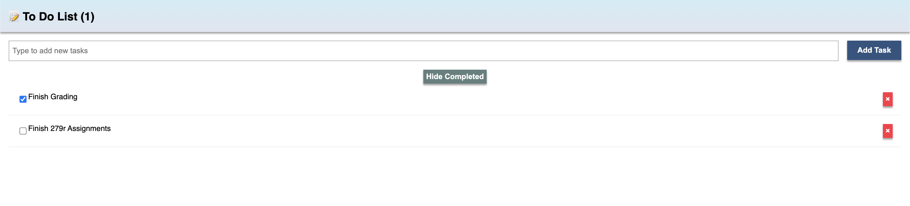

# Meteor-Svelte Todo App

You can view the prototype at this [link](https://psong-todo.meteorapp.com/).

As a previous ToDo app introduced Svelte, the main novelty about this app was the use of meteor as a backend and deployment tool. One of the advantages of Meteor is its reactive UI. This concept presumes a rapid automatic change of the user interface with each change in data. For example, once somebody posts a comment under your article, you can see it immediately, without reloading the page. Additionally, the deployment process was incredibly simple when using Meteor. Additionally, since Meteor is built in MongoDB handlers, connecting to the backend database for task management was relatively simple. Compared to the Firebase Svelte ToDo app, which required the creation of a Firestore database using the App Dashboard UI, Meteor was able to handle the creation and editing of the backend database with simple import statements.
